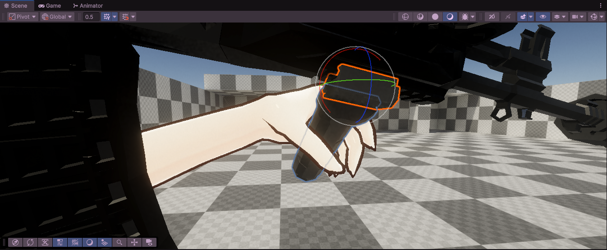

# Roach Hand Grip Calibration

[中文](#中文) · [English](#english)

> [!IMPORTANT]
> **依赖：KINEMATION FPS Animation Framework。**
> 在 Unity 中执行手部绑定流程前，请先安装并配置该插件。
> 本 skill 用于修正动画复用后的手部持枪握姿异常，包括手腕错位、手指穿模和握把设置未生效。
> 本仓库不包含 KINEMATION 插件、角色模型或武器资源。

> [!IMPORTANT]
> **Required dependency: KINEMATION FPS Animation Framework.**
> Install and configure this plugin before you use the Unity workflow.
> This skill helps correct weapon grip errors after animation reuse, including wrist offsets, finger penetration, and inactive attachment settings.
> This repository does not include the plugin, character models, or weapon assets.

[KINEMATION 官方文档 / Official documentation](https://kinemation.gitbook.io/scriptable-animation-system)



## 中文

### 用途

这是一套来自 roach Unity 项目的 Codex skill。
它检查机器人动画复用到 RifleGirl 后的手部绑定，并通过骨骼和蒙皮数据计算握姿修正。
它先定位运行时真正生效的设置，再计算手腕偏移，必要时制作角色专用的一帧握姿。

它适合处理以下问题：

- 修改 `Hand Pose Offset` 后没有变化。
- 复用 Humanoid 动画后，手腕方向或位置不正确。
- 手腕到达 IK 目标，但手指仍穿过武器。
- 切换握把或重新装备后，握姿发生变化。

### 依赖与范围

Unity 侧需要 KINEMATION FPS Animation Framework，以及你有权使用的角色和武器资源。
代理需要能读取项目源码，并通过已配置的 Unity 工具检查运行状态。
离线计算需要 Python 3.11 或更新版本、uv、NumPy 和 SciPy。
`uv run` 根据脚本中的依赖声明准备计算环境。

离线脚本可以独立运行。
完整绑定流程需要项目数据导出、Unity 资产接入和 Play Mode 验证。
本仓库不提供角色握姿预设，也不提供一键批量绑定程序。

### 项目测试记录

下表是用户提供的项目测试记录。
运行时间会随模型、点位、工具响应和验证范围变化。

| 项目 | 记录 |
| --- | --- |
| 使用模型 | GPT-6 |
| 绑定点位 | 12 个 |
| 总用时 | 约 90 分钟 |
| Unity 案例版本 | 6000.3.21f1 |

仓库内的合成测试验证计算逻辑。
它不复现这次完整 Unity 任务，也不证明当前场景已经通过验收。

### 安装

在目标 Unity 项目根目录执行以下命令。
目标目录必须尚未存在。

```powershell
git clone https://github.com/EriaWalker/roach-hand-grip-calibration.git .agents/skills/roach-hand-grip-calibration
```

在代理客户端中重新加载项目技能后，使用以下提示：

```text
使用 $roach-hand-grip-calibration 检查 Rifle_Full_Body 当前武器的实际手部绑定。
先报告实际生效的设置、层权重和手腕误差。
```

需要修改时，在提示中明确角色、武器、附件和手侧。
例如：`修复 AK12 斜握把的左手握姿，并验证重新装备后的结果。`
迁移到其他项目时，先核对骨骼名称、索引、蒙皮和框架实现。

### 工作流程

1. 查明活动武器、附件和实际 AnimationLayer 设置。
2. 排除错误索引、零权重、旧缓存和未推进的运行帧。
3. 将参考骨骼与目标蒙皮转换到同一武器坐标系。
4. 计算手腕偏移，并按需修正手指姿势。
5. 接入目标角色的资源，并重新采样。
6. 用运行时蒙皮、截图和重新装备流程验证结果。

附件可以替换 Profile 中的同类型层设置。
因此，Profile 中显示的设置不一定是当前实际生效的设置。
同为 Humanoid 也不代表骨长、骨轴和蒙皮相同。

### 离线示例

在本仓库根目录执行以下命令。
所有输出都写入 `run/`。
脚本不会写入 Unity 资产。

```powershell
uv run scripts/calibrate.py self-test --output run/self-test.json
uv run scripts/calibrate.py fit --input examples/landmarks.json --output run/fit.json
uv run scripts/calibrate.py offset --input run/fit.json --max-position-m 0.2 --output run/offset.json
uv run scripts/calibrate.py verify --input examples/synthetic-clearance.json --clearance-mm 0.5 --output run/verify.json
```

`examples/` 仅包含合成数据，不包含角色或武器网格。
`refine` 需要你导出的运行蒙皮、骨骼权重和 muscle 数值导数。
输入格式见 [计算契约](references/calculation.md)。

### 文件与验证边界

| 文件 | 用途 |
| --- | --- |
| [SKILL.md](SKILL.md) | 代理执行入口 |
| [calibrate.py](scripts/calibrate.py) | 拟合、偏移计算、接触检查和手指修正 |
| [inspect_runtime.cs.txt](scripts/inspect_runtime.cs.txt) | Unity 运行绑定只读探针 |
| [unity-workflow.md](references/unity-workflow.md) | 采样、接入、保存和运行验证 |

[AK12 案例](references/ak12-case.md) 记录历史配置与适用范围。

计算收敛只代表生成了候选。
接入后仍需检查 Humanoid 的最终输出。
顶点和三角形中心检查只覆盖有限采样，不证明所有动作全程无穿模。
双手包握还需要单独检查两只手之间的相交。

## English

### Purpose

This Codex skill comes from the roach Unity project.
It checks hand bindings when RifleGirl reuses robot animations.
It uses bone and skin data to calculate grip corrections.
It finds the active settings before it calculates wrist offsets or creates a custom pose.

Use this skill for these problems:

- Changes to `Hand Pose Offset` have no visible effect.
- A reused Humanoid animation gives the wrist an incorrect position or direction.
- The wrist reaches its IK target, but fingers enter the weapon mesh.
- The grip changes after an attachment change or weapon equip cycle.

### Requirements and scope

The Unity workflow requires KINEMATION FPS Animation Framework and character and weapon assets that you can use.
The agent needs project source access and configured Unity tools.
Offline calculations require Python 3.11 or later, uv, NumPy, and SciPy.
The script declares its dependencies for `uv run`.

The offline script can run without Unity.
The full workflow needs project data exports, Unity asset edits, and Play Mode checks.
This repository does not supply character grip presets or a batch binding tool.

### Project test record

The user supplied this project test record.
Elapsed time depends on the model, binding locations, tool response times, and validation scope.

| Item | Record |
| --- | --- |
| Model | GPT-6 |
| Binding locations | 12 |
| Total elapsed time | About 90 minutes |
| Unity case version | 6000.3.21f1 |

The synthetic tests check the calculations.
They do not reproduce the full Unity task or prove that a current scene passes validation.

### Install

Run this command from the root of the target Unity project.
The target directory must not exist.

```powershell
git clone https://github.com/EriaWalker/roach-hand-grip-calibration.git .agents/skills/roach-hand-grip-calibration
```

Reload project skills in your agent client.
Then use this prompt:

```text
Use $roach-hand-grip-calibration to inspect the active weapon bindings on Rifle_Full_Body.
Report the active settings, layer weight, and wrist error first.
```

For a repair, specify the character, weapon, attachment, and hand.
Example: `Repair the left-hand grip for the AK12 angled attachment. Verify the result after another equip cycle.`
For another project, check bone names, indices, skin data, and framework behavior first.

### Workflow

1. Find the active weapon, attachment, and AnimationLayer settings.
2. Check bone indices, layer weight, pose caches, and frame updates.
3. Convert reference bones and target skin data to the same weapon coordinate system.
4. Calculate wrist offsets and adjust finger poses as needed.
5. Apply the target character assets and sample the pose again.
6. Check the runtime skin, rendered views, and another equip cycle.

Attachments can replace settings for a layer of the same type.
The Profile settings can differ from the active settings.
Humanoid characters can have different bone lengths, bone axes, and skin weights.

### Offline examples

Run these commands from this repository root.
The script writes outputs to `run/`.
It does not write Unity assets.

```powershell
uv run scripts/calibrate.py self-test --output run/self-test.json
uv run scripts/calibrate.py fit --input examples/landmarks.json --output run/fit.json
uv run scripts/calibrate.py offset --input run/fit.json --max-position-m 0.2 --output run/offset.json
uv run scripts/calibrate.py verify --input examples/synthetic-clearance.json --clearance-mm 0.5 --output run/verify.json
```

The examples contain synthetic data only.
They contain no character or weapon meshes.
The `refine` command needs your runtime skin export, bone weights, and numerical muscle derivatives.
See the [input contract](references/calculation.md).
The detailed skill instructions and reference notes use Chinese.

### Files and limits

| File | Purpose |
| --- | --- |
| [SKILL.md](SKILL.md) | Agent instructions |
| [calibrate.py](scripts/calibrate.py) | Fit, offset, contact, and finger calculations |
| [inspect_runtime.cs.txt](scripts/inspect_runtime.cs.txt) | Read-only Unity binding probe |
| [unity-workflow.md](references/unity-workflow.md) | Pose sampling, asset edits, and runtime checks |

The [AK12 case](references/ak12-case.md) records the historical setup and its scope.

A solver result is a candidate.
Check the final Humanoid output after you apply it.
Vertex and triangle-center checks cover finite samples.
They do not prove that every animation frame has no mesh intersections.
Two-hand grips also need a separate check for intersections between the hands.

## Release contents / 发布内容

公开版保留项目流程和历史案例说明。
它用合成测试替代原项目网格回归数据，并包含用户指定的截图。
原项目仍保留自己的资源和运行证据。

This public package retains the project workflow and historical case notes.
Synthetic tests replace the original mesh regression data.
The package includes the screenshot that the user selected.
The source project retains its own assets and runtime evidence.

README 使用 `ste-writing` 的简明技术写作规则。
英文采用 STE-flavored 模式，中文遵循相同的短句和统一术语原则。

This README uses the STE-flavored rules from `ste-writing`.
The Chinese text follows the same short-sentence and consistent-term principles.
